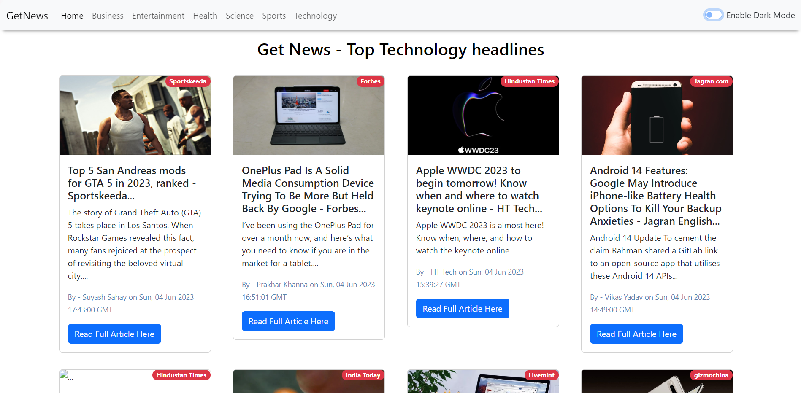
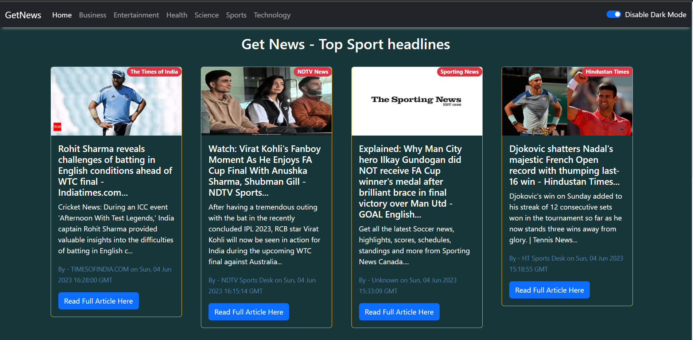

# Get News

Welcome to our news website! Here, you can stay updated with the latest news from around the country and explore top news stories in various categories. We have also implemented some exciting features to enhance your browsing experience, including an infinite scroll bar and a dark mode. Read on to learn more about how to navigate our website and make the most of its features.

## Features

1. **Top News Over the Country**: Stay informed about the most important news stories happening across the country.

2. **Top News for Each Category**: Explore top news stories in various categories, such as politics, sports, entertainment, technology, and more.

3. **Infinite Scroll Bar**: Effortlessly browse through an endless stream of news articles with our infinite scroll bar feature.

4. **Dark Mode**: Enable dark mode for a visually appealing browsing experience, particularly in low-light environments.

**Note: This project is not currently hosted on a live server.**

This project utilizes a developer API that is designed to work only on the localhost environment. Therefore, it cannot be hosted on a live server. However, by following the steps above, you can easily run the project on your local machine and explore all its features.

## Getting Started

To run this project locally, follow the steps below:

1. Clone the repository: git clone https://github.com/bhaveymunjal/GetNews.git
2. Navigate to the project directory: cd GetNews
3. Install the necessary dependencies: npm install react
4. Start the development server: npm start

5. Open your web browser and visit `http://localhost:3000` to access the news website.

## Feedback and Support

We value your feedback and are constantly working to improve our news website. If you encounter any issues, have suggestions for new features, or need support, please don't hesitate to reach out. You can give your suggestions here at bhaveymunjal3@gmail.com.

## Screenshots

Here are some screenshots of our news website:

We hope you enjoy staying informed with our comprehensive coverage, intuitive features, and a pleasant browsing experience. Thank you for choosing Get News
